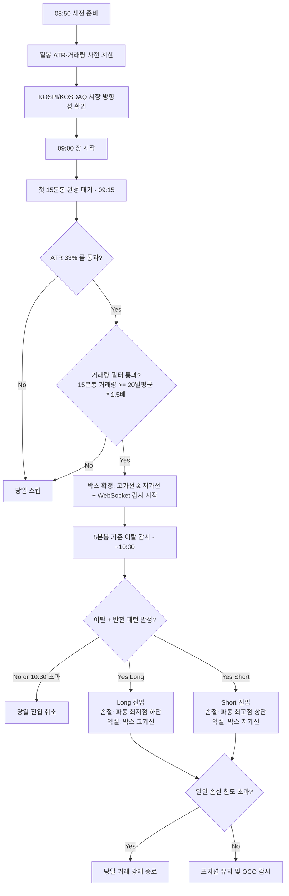

# 원캔들 시가 90분 단타 매매 전략 분석 및 코딩 계획서

> 유튜브 영상 **"5억을 잃고 깨달았습니다. 시가 90분 단타 매매면 충분하다는 걸" (ID: qNcBzk4zzdU)** 기반.  
> 영상 전략을 원본으로 하되, 실전 자동화에서 발생할 수 있는 취약점을 보완하여 재정의.

---

## 0. 원본 전략 요약 및 검토 의견

### 원본 전략 핵심
- 장 시작 후 **첫 15분봉** 고점·저점으로 박스 설정
- 박스 이탈 후 **반전 캔들 패턴** 확인 시 역방향 진입
- **10:30 이후 신규 진입 금지**, 손익비 3:1 목표

### 내 검토 의견 (보완 필요 항목)

| # | 원본의 한계 | 보완 방향 |
|---|---|---|
| 1 | 거래량 조건 없음 → 세력 부재 구간에서 휩소 발생 | 15분봉 거래량 필터 추가 |
| 2 | 시장 방향성 무시 → 하락장에서 Long 진입 위험 | KOSPI/KOSDAQ 지수 필터 추가 |
| 3 | 포지션 사이징 언급 없음 → 리스크 일정화 불가 | ATR 기반 계약 수 계산 모듈 추가 |
| 4 | 5분 폴링 방식 → 돌파 즉시 포착 불가 | WebSocket 실시간 호가 수신으로 전환 |
| 5 | 백테스트에 수수료·슬리피지 미반영 → 과적합 위험 | 현실적 비용 모델 포함 |
| 6 | 패턴 기준값(60%, 25%)의 근거 없음 | 파라미터 최적화 단계 별도 추가 |
| 7 | 일일 손실 한도 없음 → 연속 손절 시 계좌 훼손 | 일일 드로다운 상한 설정 |
| 8 | Universe 선정 기준 없음 → 비유동 종목 진입 위험 | 유동성·시가총액 필터 정의 |

---

## 1. 전략 정의 및 핵심 로직 (Strategy Definition)

본 전략은 장 초반 90분 동안 발생하는 기관/세력의 **개미 털기(Shakeout) 패턴**을 포착하고 역추세 진입 후 높은 손익비로 빠르게 익절을 확정하는 단타 전략입니다.



### 1.1 매매 원칙 (보강)

**[기존 원칙 유지]**

1. **시간대 제한**: 신규 진입은 09:15 ~ 10:30 에만 허용
2. **기준 캔들**: 첫 15분봉(09:00~09:15) 고점/저점으로 박스 설정
3. **ATR 33% 룰**: 15분봉 크기 >= 일봉 ATR(14) × 0.33
4. **반전 패턴**: 박스 이탈 후 망치형/역망치형/장악형 확인 시 진입
5. **박스 내 신호 무시**: 박스 내부 패턴은 모두 휩소로 간주

**[추가 원칙]**

6. **거래량 필터**: 첫 15분봉 거래량 >= 최근 20일 일평균 거래량의 **1.5배** 이상  
   → 세력 개입 없이 자연 진동하는 종목 제거

7. **시장 방향성 필터 (Market Regime)**:
   - KOSPI/KOSDAQ 5분봉이 전일 종가 대비 **-1.0% 이하** 하락 중이면 Long 진입 금지
   - **+1.0% 이상** 상승 중이면 Short 진입 금지

8. **Universe 필터 (사전 스크리닝)**:
   - 시가총액 **1,000억 이상**
   - 일평균 거래대금 **50억 이상** (슬리피지 최소화)
   - 전일 등락률 **-10% ~ +10%** 이내 (갭 과대 종목 제외)
   - 관리종목·투자유의 종목 제외

9. **ATR 기반 포지션 사이징**:
   ```
   위험 금액 = 총 자산 × 1% (계좌당 최대 리스크)
   손절폭 (원) = 진입가 - 손절선
   매수 주식 수 = 위험 금액 / 손절폭
   ```

10. **일일 손실 한도**: 당일 누적 손실이 총 자산의 **-2%** 도달 시 자동 거래 중단

### 1.2 진입 패턴 정의

#### Long 진입 (저가 하방 이탈 후 반전)

| 패턴 | 조건 | 진입 방식 |
|---|---|---|
| 망치형(Hammer) | 아래꼬리 >= 전체 범위 × 60%, 몸통 <= 전체 범위 × 25% | 직전봉 고가 돌파 시 **시장가 즉시 매수** |
| 상승 장악형(Bullish Engulfing) | 현재 양봉 몸통이 직전 음봉 몸통을 완전히 포함 | 5분봉 **종가 시장가 매수** |

#### Short 진입 (고가 상방 이탈 후 반전)

| 패턴 | 조건 | 진입 방식 |
|---|---|---|
| 역망치형(Shooting Star) | 윗꼬리 >= 전체 범위 × 60%, 몸통 <= 전체 범위 × 25% | 직전봉 저가 하향 돌파 시 **시장가 즉시 매도** |
| 하락 장악형(Bearish Engulfing) | 현재 음봉 몸통이 직전 양봉 몸통을 완전히 포함 | 5분봉 **종가 시장가 매도** |

> **주의**: 패턴 기준값(60%, 25%)은 임의값입니다. 반드시 Step 0(파라미터 최적화)에서 백테스트로 검증 후 확정해야 합니다.

### 1.3 청산 규칙

| 구분 | 조건 |
|---|---|
| **익절** | 박스 반대편 선 도달 (Long → 15분봉 고가선, Short → 15분봉 저가선) |
| **손절** | 진입 파동의 꼬리 최저점(최고점) 하단(상단) |
| **시간 청산** | 장 마감 30분 전(14:50) 미청산 포지션 전량 강제 청산 |
| **일일 한도** | 당일 누적 손실 -2% 도달 시 보유 포지션 즉시 전량 청산 |

---

## 2. 개발 아키텍처 및 모듈 구성 (System Architecture)

```
📁 one_candle_bot/
│
├── 📄 config.py                 # API Key, 계좌번호, Universe 설정, 리스크 파라미터
├── 📄 main.py                   # 메인 제어 루프 및 스케줄러 (08:50 ~ 15:30)
│
├── 📁 market/
│   ├── 📄 api_client.py         # KIS REST API 클라이언트 (일봉·분봉 조회, 주문 API)
│   ├── 📄 websocket_client.py   # KIS WebSocket 실시간 호가·체결 수신 (신규 추가)
│   ├── 📄 data_processor.py     # ATR 계산, 15분봉 박스 확정, 거래량 필터 처리
│   └── 📄 universe.py           # Universe 사전 스크리닝 (시총·거래대금·등락률 필터)
│
├── 📁 strategy/
│   ├── 📄 filters.py            # ATR 33% 룰, 거래량 필터, 시장 방향성 필터 (신규 추가)
│   ├── 📄 pattern.py            # 망치형·역망치형·장악형 판별 알고리즘
│   ├── 📄 position_sizer.py     # ATR 기반 포지션 사이즈 계산 (신규 추가)
│   └── 📄 execution.py          # 진입·청산 주문 및 OCO 감시
│
├── 📁 risk/
│   ├── 📄 daily_limit.py        # 일일 손실 한도 감시 및 강제 청산 처리 (신규 추가)
│   └── 📄 position_tracker.py   # 실시간 포지션 손익 추적
│
├── 📁 backtest/
│   ├── 📄 backtester.py         # 시뮬레이션 엔진 (수수료·슬리피지 포함)
│   ├── 📄 optimizer.py          # 패턴 파라미터 최적화 (Grid Search) (신규 추가)
│   ├── 📄 report.py             # 성과 리포트 출력 (승률·손익비·MDD·샤프비율)
│   └── 📄 test_universe.csv     # 백테스팅 대상 종목 리스트
│
└── 📁 notify/
    └── 📄 telegram.py           # 텔레그램 알림 (진입·청산·에러·일일 리포트)
```

---

## 3. 세부 구현 계획 및 로직 (Detailed Implementation Plan)

### Step 0: 파라미터 최적화 (백테스트 선행) ← 신규 추가

> **이유**: 패턴 기준값(60%, 25%, ATR 33%)이 영상 기준일 뿐 검증되지 않았음.  
> 실제 코드 작성 전 최적값 범위를 먼저 확인해야 과적합 없는 전략 구현 가능.

```python
# optimizer.py 예시 구조
PARAM_GRID = {
    "atr_ratio": [0.25, 0.33, 0.40],          # ATR 필터 비율
    "hammer_tail_ratio": [0.50, 0.60, 0.70],   # 꼬리 비율
    "hammer_body_ratio": [0.20, 0.25, 0.30],   # 몸통 비율
    "volume_multiplier": [1.3, 1.5, 2.0],      # 거래량 배수
}
# Grid Search → 각 조합별 손익비·승률·MDD 측정 후 최적 파라미터 선정
```

### Step 1: Universe 스크리닝 모듈 (`market/universe.py`)

- **실행 시점**: 매일 08:50 장 시작 전 1회 실행
- **필터 조건**:
  1. 시가총액 >= 1,000억
  2. 최근 20일 일평균 거래대금 >= 50억
  3. 전일 등락률 -10% ~ +10%
  4. 관리종목·투자경고·투자유의 제외
- **출력**: 당일 모니터링 대상 종목 리스트 (최대 20종목 권장)

### Step 2: 데이터 처리 모듈 (`market/data_processor.py`)

**일봉 ATR(14) 계산**:
```
TR = max(High - Low, |High - Prev_Close|, |Low - Prev_Close|)
ATR_14 = TR의 14일 단순이동평균 (또는 RMA)
```

**15분봉 데이터 확정 (09:15)**:
```
Range_15m = High_15m - Low_15m
유효 조건: Range_15m >= ATR_14 * 0.33
거래량 조건: Volume_15m >= Avg_Volume_20d * 1.5
→ 두 조건 모두 통과한 종목만 당일 감시 대상 선정
```

**시장 방향성 체크** (`strategy/filters.py`):
```
KOSPI_return = (KOSPI_current - KOSPI_prev_close) / KOSPI_prev_close
if KOSPI_return <= -0.01 → Long 금지 플래그 활성
if KOSPI_return >= +0.01 → Short 금지 플래그 활성
```

### Step 3: 실시간 감시 엔진 (`market/websocket_client.py` + `strategy/execution.py`)

**기존 5분 폴링 → WebSocket 실시간으로 전환**:
- KIS OpenAPI WebSocket 채널 구독: 실시간 체결 데이터 수신
- 15분봉·5분봉은 틱 데이터를 집계하여 자체 생성
- 박스 이탈 감지를 틱 레벨에서 수행하여 지연 최소화

**Long 진입 감시 시나리오**:
1. 틱 가격 < 박스 저가선 → 이탈 상태 활성화
2. 5분봉 마감 시 반전 패턴(망치형/상승장악형) 판별
3. 상승장악형: 종가 즉시 시장가 매수
4. 망치형: 직전봉 고가를 트리거 가격으로 등록 → 틱이 해당 가격 돌파 시 즉시 매수
5. 진입 즉시 포지션 트래커 등록 및 OCO 감시 시작

**포지션 사이즈 계산** (`strategy/position_sizer.py`):
```python
def calc_position_size(account_equity, entry_price, stop_price, risk_pct=0.01):
    risk_amount = account_equity * risk_pct          # 리스크 금액 (총자산 1%)
    stop_loss_gap = abs(entry_price - stop_price)    # 손절폭 (원)
    shares = int(risk_amount / stop_loss_gap)        # 매수 주식 수
    return max(shares, 1)
```

### Step 4: 리스크 관리 모듈 (`risk/daily_limit.py`)

```python
class DailyRiskManager:
    def __init__(self, equity, max_daily_loss_pct=0.02):
        self.daily_loss_limit = equity * max_daily_loss_pct
        self.realized_loss = 0.0

    def check_and_halt(self, pnl_today) -> bool:
        """True 반환 시 당일 거래 강제 중단"""
        return pnl_today <= -self.daily_loss_limit
```

### Step 5: 백테스터 구축 (`backtest/backtester.py`)

**현실적 비용 모델 포함**:
```
수수료: 0.015% (매수) + 0.015% (매도)
증권거래세: 0.20% (매도 시)
슬리피지: 0.05% (시장가 주문 기준)
→ 편도 실질 비용 ≈ 0.28%, 왕복 ≈ 0.56%
```

**성과 지표**:
- 승률 (Win Rate): 목표 55% 이상
- 손익비 (Profit Factor): 목표 2.0 이상
- MDD (Maximum Drawdown): 허용 -15% 이내
- 샤프 비율 (Sharpe Ratio): 목표 1.5 이상
- 평균 보유 시간 (Avg Hold Time)

---

## 4. 검증 및 테스트 계획 (Verification Plan)

### 4.1 백테스팅

- **데이터**: 삼성전자(005930), SK하이닉스(000660), 셀트리온(068270) 등 유동성 상위 종목의 최근 **2년** 5분봉·일봉 데이터
- **기간 분할**: In-Sample 18개월 (최적화), Out-of-Sample 6개월 (검증) → 과적합 방지
- **파라미터 최적화 → 검증 순서 반드시 준수**

### 4.2 모의투자 (Paper Trading)

- KIS 모의투자 계좌 연동
- 최소 **20 거래일** 이상 실제 09:00~10:30 운영
- 텔레그램으로 조건 충족·진입·청산 결과 실시간 수신
- 실제 슬리피지·지연 측정 및 백테스트 결과와 비교

### 4.3 단위 테스트 (Unit Test)

```
tests/
├── test_atr.py           # ATR 계산 정확도 검증
├── test_patterns.py      # 패턴 판별 함수 (정상·이상 케이스)
├── test_position_sizer.py # 포지션 사이즈 계산 검증
├── test_daily_limit.py   # 일일 한도 강제 청산 동작 검증
└── test_filters.py       # 거래량·시장방향 필터 검증
```

---

## 5. 단계별 개발 일정 (Implementation Roadmap)

| 단계 | 개발 항목 | 주요 내용 | 완료 기준 |
|:---|:---|:---|:---|
| **0단계** | 파라미터 최적화 (백테스트 선행) | 과거 데이터로 ATR 비율·패턴 기준값 Grid Search | Out-of-Sample 손익비 2.0 이상 확인 |
| **1단계** | 환경 설정 및 Universe 모듈 | `config.py`, KIS REST API 연동, Universe 스크리닝 | 매일 08:50 정상 종목 리스트 출력 확인 |
| **2단계** | 데이터 처리 및 필터 모듈 | ATR 계산, 거래량 필터, 시장방향 필터, 박스 확정 | 특정 날짜 데이터 입력 시 필터 통과 종목 정확히 선별 |
| **3단계** | 패턴 판별 로직 | 4가지 패턴 함수 작성 및 단위 테스트 | 테스트 케이스 100% 통과 |
| **4단계** | WebSocket + 포지션 사이저 | 실시간 호가 수신, ATR 기반 사이즈 계산 | 실시간 틱 수신 및 박스 이탈 즉시 감지 확인 |
| **5단계** | 주문 엔진 + 리스크 관리 | OCO 주문, 일일 손실 한도 강제 청산 | 모의계좌에서 진입·OCO·강제청산 정상 동작 |
| **6단계** | 안정화 및 운영 | 네트워크 복구, 장 마감 처리, 텔레그램 일일 리포트 | 무중단 5 거래일 이상 모의 운영 무에러 |

---

## 6. 주요 리스크 및 대응 (Risk Register)

| 리스크 | 발생 가능 상황 | 대응책 |
|---|---|---|
| 연속 손절 | 시장 변동성 폭등 시 ATR 필터 오작동 | 일일 한도(-2%) 도달 시 자동 중단 |
| 슬리피지 과다 | 소형주 진입 시 호가 스프레드 확대 | 거래대금 50억 이상 종목으로 제한 |
| 네트워크 단절 | WebSocket 연결 끊김 | 자동 재연결 로직 + 미체결 주문 즉시 취소 |
| 갭 하락/상승 | 다음날 급등락 시작 | 장 시작 후 첫 틱 확인 후 ATR 재계산 |
| 패턴 과적합 | In-Sample 기간 최적화 편향 | Out-of-Sample 6개월 별도 검증 필수 |
| API 장애 | KIS API 점검 또는 오류 | 헬스체크 루프 + 텔레그램 긴급 알림 |

---

## 7. 다중 전략(A/B/C) 테스트 및 실전 반영 계획 (Strategy Evaluation Framework)

모의투자 단계에서 단일 전략에 의존하지 않고, 성격이 다른 3가지 로직을 병렬로 테스트하여 **가장 안정적이고 수익률이 높은 전략을 실전(본 투자)에 반영**하기 위한 검증 프레임워크입니다.

### 7.1. 3가지 병렬 테스트 조건 (전략 A, B, C)

모든 전략은 **"개장 후 09:15 유니버스 확정 → 09:15~10:30 사이 타점 발생 시 진입"** 이라는 대원칙(초심)을 공유하되, **진입 타점(Trigger)**의 성격만 다르게 설정합니다.

| 전략명 | 전략 A (역추세 휩소 공략) | 전략 B (순추세 강한 돌파) | 전략 C (돌파 후 눌림목 지지) |
|---|---|---|---|
| **기본 개념** | 기존 원캔들 로직. 15분 박스를 하방 이탈하는 척하다가 다시 말아 올리는 속임수 패턴 공략. | 15분 박스 상단을 강력하게 뚫고 나가는 순방향 모멘텀에 올라타는 전략. | 돌파가 일어난 후, 주가가 다시 이전 박스 상단(저항선→지지선)으로 내려올 때 줍는 전략. |
| **패턴 조건** | 5분봉 기준 망치형(Hammer) 또는 상승 장악형(Engulfing) 발생 시 | 종가가 박스 상단을 명확히 돌파 (시가는 박스 안 또는 경계선) | 한 번 돌파한 이력이 있고, 현재가 저점이 박스 상단 근접, 종가는 지지함 |
| **목표 손익비** | **3.0** 이상 (손절선이 매우 타이트함) | **1.5** (돌파 실패 위험이 커서 방어적 익절) | **3.0** 이상 (안전한 지지 확인) |
| **예상 특징** | 승률은 보통이나, 한 번 크게 먹어 누적 수익을 쌓는 형태. | 타점이 자주 발생하고 승률이 높지만, 휩소(거짓 돌파)에 취약함. | 타점이 매우 드물게 발생하지만, 진입 시 승률과 손익비 모두 우수할 것으로 기대됨. |

### 7.2. 기록 및 평가 지표 (Evaluation Metrics)

매일 장 마감 후 `trade_history_{A/B/C}.csv`에 쌓인 데이터를 기반으로 다음 4가지 지표를 중점적으로 평가합니다.

1. **승률 (Win Rate)**: `익절 횟수 / 총 거래 횟수` (단타 생존의 핵심 지표)
2. **평균 손익비 (Average R:R)**: `평균 수익 금액 / 평균 손실 금액`
3. **최대 낙폭 (MDD, Maximum Drawdown)**: 모의 자본금 1,000만 원 대비 가장 깊게 파였던 손실률
4. **거래 빈도 (Trade Frequency)**: 하루 평균 몇 번의 매매가 발생하는가? (너무 없어도 문제, 너무 많아도 뇌동매매 위험)

### 7.3. 실전 본 투자 반영(Transition) 프로세스

**Phase 1: 모의투자 데이터 축적 (최소 2~4주)**
- 시스템이 매일 자동으로 3개의 전략을 굴리며 데이터를 쌓습니다.
- 텔레그램 일일 리포트를 통해 직관적으로 성과를 모니터링합니다.

**Phase 2: 성과 분석 및 전략 가지치기**
- 한 달간의 데이터를 모아 승률과 손익비를 계산합니다.
- 만약 전략 B(돌파)가 승률은 높지만 휩소로 인한 누적 손실이 더 크다면 과감히 폐기하거나, 거래량 조건을 2배에서 3배로 높이는 식의 피드백을 진행합니다.
- 성과가 저조한 전략은 버리고, 성과가 좋은 전략의 파라미터(손익비, 손절라인)를 세밀하게 조율합니다.

**Phase 3: 승자 전략 실전 투입**
- 최종적으로 **가장 높은 샤프 비율(안정적인 누적 수익)**을 기록한 전략 하나를 채택합니다.
- 채택된 전략만 `mock_trade` 모듈이 아닌 KIS 실전 주문 API(`order.py`)로 연결하여, 소액(예: 100만 원)부터 실제 매매를 가동합니다.
